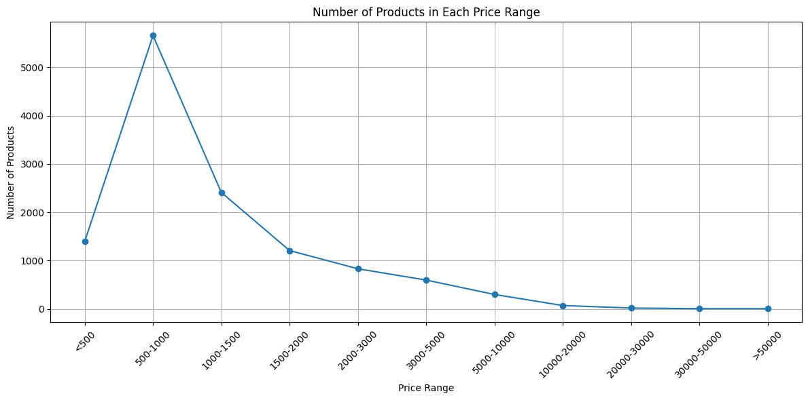
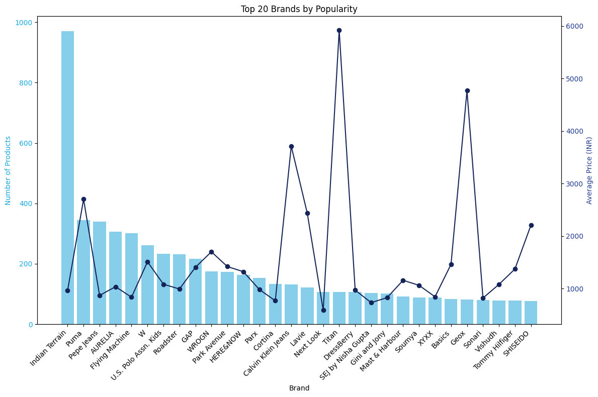

## Ecommerce Pricing Trends Analysis

 
## Overview
- Google Cloud Reviews on Zalora: ([Article](https://medium.com/towards-data-science/what-is-data-quality-f2c0274a6404)) 

Myntra is a major e-commerce company. Zalora is also a major SEA e-commerce company. Zalora has increased sales and revenues by personalizing customers’ experiences on its websites and mobile applications.

## Table of Content
- [Motivation](#Motivation)
- [Tools and Libraries Used](#Tools-and-Libraries-Used)
- [Dataset Preparation](#Dataset-Preparation)
- [Notable EDA Insights](#Notable-EDA-Insights)
- [Acknowledgements](#Acknowledgements)

## Motivation

This data set includes details on a variety of goods that are sold on Myntra. It contains information about product names, categories, and costs.

**Use:** Taking advantage of this dataset, we looked at pricing distribution and product popularity to identify common market patterns.

## Tools and Libraries Used
We have used Python 3 to its following packages:
- Pandas
- Matplotlib
- Seaborn
- Beautifulsoup

## Dataset Preparation:
 - Cleaned and enriched dataset.
 - Checked and adjusted data types.    
**
Table 1: Variables description 
**
<table border="1" class="dataframe">
  <thead>
    <tr style="text-align: right;">
      <th></th>
      <th>Attribute</th>
      <th>Description</th>
      <th>Notes</th>
      <th>Data Type</th>
    </tr>
  </thead>
  <tbody>
    <tr>
      <th>ProductName</th>
      <td>Name of items, including clothing, footwear, accessories, and more.</td>
      <td>-</td>
      <td>Categorical</td>
    </tr>
    <tr>
      <th>ProductBrand</th>
      <td>Brands indicating items, including clothing, footwear, accessories, and more.</td>
      <td>-</td>
      <td>Categorical</td>
    </tr>
    <tr>
      <th>Gender</th>
      <td>Breakdown of products by gender such as men’s, women’s, and unisex’s products, enabling targeted market analysis</td>
      <td>-</td>
      <td>Men or   Female or   Unisex</td>
      <td>Categorical</td>
    </tr>
    <tr>
      <th>Price</th>
      <td>Information on retail prices, discounts, and special offers, providing insights into pricing strategies and competitive positioning.</td>
      <td>-</td>
      <td>Integer</td>
    </tr>
    <tr>
      <th>Description</th>
      <td>Detailed descriptions and specifications data on a wide range of brands</td>
      <td>-</td>
      <td>Text</td>
    </tr>
  </tbody>
</table>

# Notable EDA Insights
!
!

## Key Findings:
 - Analyzed data from 2021 to 2023.
 - 3500 total orders.
 - Totalled sales of $1.88 million.
 - Myntra sells goods under 72 brands.
 - Overall, users give the app a 4 out of 5.
 
 ## Brand Performance:
 - The brand with the greatest sales was H&M.
 - The brand with the lowest sales volume was La-Zoire.
 
 ## Month-wise Insights:
 - May 2021 and June 2022 stood out as peak sales months.
 - Noted a shift in category sales: men led in 2021, women in 2022.

- **For Sellers:** 
  - Produce more in-demand items to cut down on material waste.
  - Steer clear of overproducing less-popular goods.
  - Optimize inventory based on trend analysis.

- **For Customers:** 
  - Stay updated on the latest trends.
  - Based on consumer reviews and product popularity, make well-informed purchasing selections.
  - Easily locate stylish and in-demand products.

## Acknowledgements
The data is originally from the article Myntra Products Dataset, written by Ronak Bokaria, Kaggle, May 2023. The data was downloaded and cleaned by Crawlfeed during the week of February 11th, 2020.
